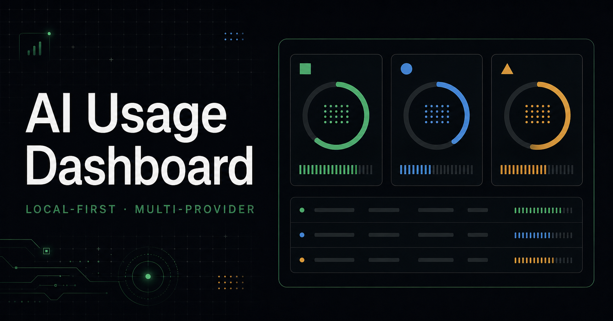

# AI Usage Dashboard

[](https://github.com/0xBigotry7/ai-usage-dashboard/actions/workflows/ci.yml)
[](https://github.com/0xBigotry7/ai-usage-dashboard/releases)
[](LICENSE)
[](package.json)

**One glance at every AI subscription you burn: quota windows, reset timers,
balances, and real token counts — collected locally, shown your way.**



[中文说明](README.zh-CN.md)

Your AI coding tools each hide usage in a different place. This tool reads
them all on your own machine and shows one honest picture on three surfaces:

- **Browser dashboard** — quota rings, reset countdowns, balances, layered
  token views, history trends;
- **Always-on display** — a `/display` view built for 480×320 / 800×480
  screens next to your monitor;
- **macOS menu bar** — a native companion that keeps your top three
  providers visible all day.

Out of the box it understands **OpenAI Codex, Claude Code, Kimi Code,
OpenAI API, OpenRouter, DeepSeek, and GitHub Copilot**, plus a documented
snapshot schema for anything else.

Nothing leaves your machine: the collector runs on `127.0.0.1`, reads
CLI-owned files and documented billing endpoints, and never touches message
content or stores provider credentials in the repo or browser.

## Your keys never leave your machine

Worried a usage tool might phone home with your credentials? This one is
built so it structurally cannot:

- **Local-only by default.** The collector binds `127.0.0.1` and rejects
  requests with a non-loopback `Host` header (`collector/server.mjs`). There
  is no telemetry, no analytics, no update check — the only network calls
  are to the provider APIs you configured.
- **Keys stay in one file you own**: `~/.usage-hub/env`, created with mode
  `0600`, outside the repository. Credentials are never written to the
  browser, logs, or history database.
- **Session logs are read for numbers only.** The Codex/Claude Code parsers
  extract token counters, model names, and session-relationship metadata —
  prompts and responses are never read into memory as data, exported, or
  displayed (`collector/session-log-estimate.mjs`, `collector/claude-session-log.mjs`).
- **Cloud sync is off unless you turn it on**, and the hosted ingest accepts
  a strict field allowlist that has no place to put a secret: numeric usage,
  reset times, and display metadata only — OAuth tokens, API keys, hostnames,
  file paths, prompts, and raw logs are rejected by schema
  (`lib/remote-usage.ts`, enforced by tests).
- **It's MIT-licensed and small.** `grep -rn "fetch(" collector/` shows every
  outbound call. Audit it in an afternoon.

## Quick start

Requirements: macOS or Linux, Node.js 22.13+.

```bash
npx ai-usage-hub            # published from v0.10.0
```

This starts the local collector, serves the dashboard, and opens your
browser. On macOS, `npx ai-usage-hub menubar` installs and launches
the bundled menu bar app.

Or from source:

```bash
git clone https://github.com/0xBigotry7/ai-usage-dashboard.git
cd ai-usage-dashboard
npm ci
npm run local
```

Open <http://localhost:3000>. If you already use the Codex or Claude Code
CLI on this machine, real data appears on the first load — no configuration.

Optional providers take one command each:

```bash
npm run configure:kimi                          # Kimi Code API key
npm run configure:provider -- openai-api        # or openrouter / deepseek / github-copilot
```

## macOS menu bar

```bash
npm run build:menubar
open "dist/AI Usage Dashboard Menu Bar.app"
```

The app starts its own local collector and shows up to three providers in
the menu bar, with every quota window, reset time, and today's observed
tokens in its popover. Requires Node.js 22.13+ on the machine (Homebrew,
nvm, mise, and asdf installs are all discovered; `USAGE_HUB_NODE` overrides).
Drag the app to `/Applications` and enable **Launch at Login** to keep it.

Builds are ad-hoc signed for personal use; see
[macOS packaging and signing](docs/macos-release.md) before distributing.

---

# Details

## How the numbers are kept honest

Four concepts stay separate and labeled — they are never silently mixed:

- **quota** — the percentage and reset time a provider reports;
- **official API usage** — exact tokens/credits from a documented billing
  endpoint;
- **observed tokens** — counters read from local CLI session logs;
- **token equivalent** — your own configured capacity × quota percentage.

The overview shows three independent layers (recorded today, recorded this
subscription cycle, quota conversion). A provider with no observed source
shows as unavailable rather than a fabricated zero, and estimated reset
times are labeled as estimates.

## Included adapters

| Adapter | Quota source | Token methods | Credential boundary |
| --- | --- | --- | --- |
| OpenAI Codex | Existing Codex CLI OAuth session | Optional quota conversion and local `token_count` events | Reads CLI-owned files; never writes credentials |
| Claude Code | None; no documented quota endpoint | Observed today and trailing-7-day tokens from local per-message `usage` records | Reads CLI-owned session logs; never message content or credentials |
| Kimi Code | API key or unexpired CLI session | Optional quota conversion | Optional key stored outside the repository with mode `0600` |
| OpenAI API | Documented Organization Usage API | Exact seven-day model tokens and request counts | Admin key stays in the local collector |
| OpenRouter | Documented current-key endpoint | Key spend, limit, and reset period | API key stays in the local collector |
| DeepSeek API | Documented user-balance endpoint | Balance only; no invented quota window | API key stays in the local collector |
| GitHub Copilot | Documented user AI Credits billing endpoint | Monthly AI Credits, optionally compared with a configured limit | Fine-grained token with `Plan: read` stays local |
| Custom snapshot | Any collector that emits the normalized schema | Any normalized method | Hosted ingest accepts only a strict field allowlist |

The Codex and Kimi quota endpoints are used by official clients but are not
documented as stable third-party APIs. The remaining direct adapters use
documented provider APIs. See [Security and limitations](docs/security.md).

## Token and usage methods

**Official API usage.** OpenAI Organization Usage returns exact token and
request totals grouped by model. GitHub reports AI Credits, OpenRouter
reports key spend, and DeepSeek reports account balance. These values are
never converted into subscription quota.

**Quota conversion.** `estimated tokens = weekly used percentage ×
configured weekly capacity`. There is no built-in capacity — without your
calibration the dashboard shows the percentage alone:

```bash
npm run configure:capacity -- kimi 10000000   # or codex; pass "clear" to remove
```

**Local CLI logs.** The Codex and Claude Code adapters read only token
counters, model names, and session-relationship metadata from local JSONL
files — never prompts or responses. Counters are accumulated as deltas;
when a fork or resumed session replays an ancestor's history, the matching
prefix is removed so child-agent work never multiplies parent usage.
`totalTokens = inputTokens + outputTokens`; cached input and reasoning
output are labeled subsets, not added twice. This method covers this
machine only. Disable with `USAGE_HUB_CODEX_LOG_ESTIMATE=off` or
`USAGE_HUB_CLAUDE_LOG_ESTIMATE=off`.

## macOS menu bar, in depth

The companion reads its bundled loopback collector every 60 seconds, while
provider APIs are polled at most once every five minutes with retry and
backoff. The menu bar keeps three providers visible (`*` marks a stale
snapshot, `ERR` a provider error); the popover shows every quota window,
reset times, balances, freshness, today's observed input + output, and up
to three per-model token totals. Pace projections appear only when a real
duration and reset time exist, and opt-in 70/80/90% alerts are deduplicated
per cycle. Pace and notification behavior was adapted from ideas in
CodexBar — see [attribution](docs/attribution.md#codexbar-implementation-review).

## External always-on display

`/display` fits 480×320 and 800×480 without scrolling, pages automatically
every eight seconds, and offers fullscreen plus Screen Wake Lock controls.
See [External display and kiosk setup](docs/external-display.md).

## Optional hosted dashboard

Deploy to Cloudflare Workers + D1: collectors push sanitized snapshots
through a bearer-protected ingest endpoint; viewers use a separate access
code. The hosted schema accepts numeric usage and display metadata only —
never OAuth tokens, API keys, hostnames, file paths, prompts, or raw logs.
See [Configuration and deployment](docs/configuration.md).

## Adding providers

Local adapters register in `collector/providers/index.mjs` and return one
normalized provider object; every surface stays provider-agnostic. Read
[Provider development](docs/provider-development.md) first — new adapters
should add a trustworthy capability, not just a logo.

## Project map

```text
app/                  Dashboard and hosted API routes
app/display/          Always-on external display route
collector/providers/  Local provider adapters and registry
collector/            History and token estimators
lib/                  Snapshot sanitization and viewer authentication
db/ + drizzle/        D1 schema and migration
worker/               Cloudflare Worker entry point
scripts/              Local configuration helpers
apps/macos-menu-bar/  Native macOS menu bar companion
tests/                Normalization, estimation, security, and render tests
```

## Documentation

- [Architecture and data flow](docs/architecture.md)
- [External display and kiosk setup](docs/external-display.md)
- [macOS packaging, signing, and Homebrew](docs/macos-release.md)
- [Configuration and Cloudflare deployment](docs/configuration.md)
- [Provider development](docs/provider-development.md)
- [Security model and limitations](docs/security.md)
- [Attribution and provenance](docs/attribution.md) · [Third-party notices](THIRD_PARTY_NOTICES.md)
- [Roadmap](docs/roadmap.md) · [Changelog](CHANGELOG.md) · [Contributing](CONTRIBUTING.md)

## Status and trademarks

An early open-source project with deliberately honest gaps: missing quota
windows stay visibly missing. Bundled provider artwork comes from
[`@lobehub/icons-static-svg` 1.94.0](https://github.com/lobehub/lobe-icons)
(MIT), stored locally. Product names and logos belong to their owners.
AI Usage Dashboard is not affiliated with OpenAI, Anthropic, Moonshot AI,
Cloudflare, CodexBar, Lobe Icons, or ccusage.

## License

[MIT](LICENSE)
