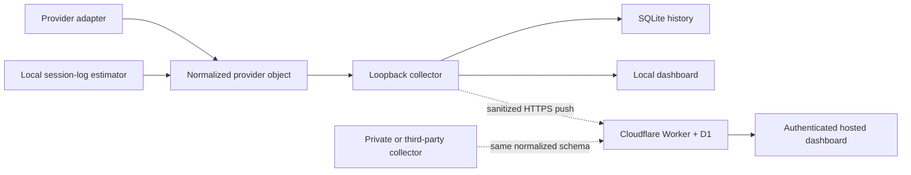

# Architecture

AI Usage Dashboard separates collection, normalization, storage, and display.
Provider credentials stay with the process that owns them.



## Components

### Provider adapters

`collector/providers/index.mjs` is the local registry. Each adapter:

1. reads a provider-owned login or a private user configuration;
2. fetches quota data;
3. normalizes windows, reset times, balance, and status;
4. attaches zero or more independent token estimates.

The included adapters are Codex and Kimi Code. New adapters do not require UI
changes when they follow the normalized schema.

### Local collector

`collector/server.mjs`:

- binds to `127.0.0.1:4317`;
- refreshes adapters concurrently;
- exposes current usage, seven-day history, and manual refresh;
- stores normalized history in `~/.usage-hub/usage.db`;
- optionally pushes a sanitized snapshot to an HTTPS endpoint;
- optionally merges additional sanitized providers from the hosted dashboard.

Providers read back from the cloud are tagged `remote_snapshot` and excluded
from the next outbound push, preventing loops.

### Token estimators

The normalized provider object can contain `tokenEstimates[]`.

`quota_percentage` multiplies the provider's weekly percentage by a configured
capacity. It can represent account-wide usage but relies on a calibration
assumption.

`session_logs` scans local Codex JSONL files for `token_count` and model metadata
events. It sums cumulative-counter deltas during the past seven days. It does
not inspect or export message bodies. It can miss other devices and deleted
logs.

The UI compares these methods and never adds them together.

### Reset-time inference

When a provider omits `resetsAt`, the dashboard may estimate the next reset only
after sanitized history shows an actual percentage drop for that exact window.
The midpoint between the last pre-reset and first post-reset samples becomes
the anchor. The UI advances by the provider-reported duration and labels the
result as estimated. Without an observed drop, the time remains unknown.

### Hosted application

The Cloudflare deployment uses:

- `/api/ingest` for bearer-authenticated snapshot writes;
- `/api/session` to exchange a viewer code for a secure cookie;
- `/api/usage` and `/api/history` for authenticated reads;
- D1 for current provider rows and bounded history.

The ingest route stores providers independently, so collectors can update at
different times.

## Normalized schema

A minimal provider looks like:

```json
{
  "id": "example-ai",
  "name": "Example AI",
  "shortName": "EA",
  "accent": "#8bb8ff",
  "state": "ready",
  "plan": "Pro",
  "source": "Example collector",
  "sourceKind": "custom",
  "updatedAt": "2026-07-24T12:00:00.000Z",
  "windows": [
    {
      "id": "weekly",
      "label": "This week",
      "durationSeconds": 604800,
      "usedPercent": 32,
      "used": null,
      "limit": null,
      "remaining": null,
      "resetsAt": "2026-07-27T00:00:00.000Z"
    }
  ],
  "balance": null,
  "message": null,
  "tokenEstimates": [
    {
      "basis": "quota_percentage",
      "estimated": true,
      "totalTokens": 3200000,
      "capacityTokens": 10000000,
      "usedPercent": 32,
      "windowId": "weekly",
      "models": [
        {
          "id": "example-subscription",
          "label": "Example subscription",
          "windowId": "weekly",
          "usedPercent": 32,
          "capacityTokens": 10000000,
          "estimatedTokens": 3200000,
          "countedInTotal": true
        }
      ],
      "assumption": "Weekly percentage multiplied by configured capacity."
    }
  ]
}
```

The sanitizer accepts provider IDs matching
`^[a-z0-9][a-z0-9_-]{0,31}$`, bounded display fields, up to eight windows, and
up to four token estimates. Unknown properties are discarded.

## Data minimization

| Boundary | Allowed | Rejected |
| --- | --- | --- |
| Adapter to local collector | Normalized usage plus in-memory credentials used by that adapter | Nothing is forwarded automatically |
| Collector to cloud ingest | Provider display fields, status, numeric usage, reset times, estimates | Tokens, keys, hostnames, paths, raw logs, messages |
| Cloud to browser | Sanitized current rows and history after viewer authentication | Ingest secret and provider credentials |

All usage responses use `Cache-Control: private, no-store`.

## Public/private boundary

The public repository contains the provider-neutral snapshot contract, not
machine-specific collectors or private account workflows. A private collector
can run anywhere appropriate and send only the normalized object above.
